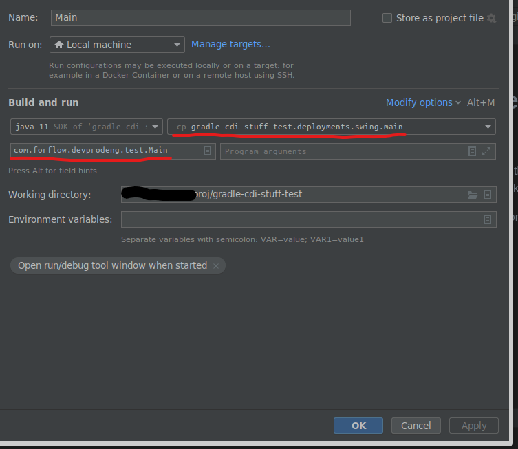

# Example project for reproducing an IntelliJ(?) Bug
Rough structure:
```
    :deployments:swing
       /          \
:modules:javase  :modules:businesslogic
       \          /
      :modules:base
```

`base` includes the API, which `businesslogic` implements. 
`javase` has a main method that wants to have an implementation of API, which it is decoupled from.
`deployments` includes both together (as runtime dependencies) to provide a runnable package, which is glued together by Weld (CDI).


## How to reproduce:
Step 1:
Open this project in IntelliJ IDEA (should be imported as a gradle project),
runtime is openjdk 11


Step 2:
Set up a Run configuration as follows:


Step 3:
Run the configuration


### Expected Result:
Everything of the following:
1. running it succeeds without an error
2. the classpath output includes the businesslogic module 
3. it outputs (among other lines):
```
This is important: This is the result
```

### Actual Result:
```
5:15:49 PM: Executing ':modules:javase:Main.main()'...

> Task :modules:base:compileJava UP-TO-DATE
> Task :modules:base:processResources NO-SOURCE
> Task :modules:base:classes UP-TO-DATE
> Task :modules:base:jar UP-TO-DATE
> Task :modules:javase:compileJava UP-TO-DATE
> Task :modules:javase:processResources UP-TO-DATE
> Task :modules:javase:classes UP-TO-DATE

> Task :modules:javase:Main.main() FAILED
Hello world!
java classpath: /home/user/proj/gradle-cdi-stuff-test/modules/javase/build/classes/java/main:/home/user/proj/gradle-cdi-stuff-test/modules/javase/build/resources/main:/home/user/proj/gradle-cdi-stuff-test/modules/base/build/libs/base.jar:/home/user/.gradle/caches/modules-2/files-2.1/org.jboss.weld.se/weld-se-core/3.1.9.Final/6fa20603761d45e5cf6c12d6cfe8d017898d6ac5/weld-se-core-3.1.9.Final.jar:/home/user/.gradle/caches/modules-2/files-2.1/org.jboss.weld.probe/weld-probe-core/3.1.9.Final/8ddf275ed0f87ec8058246277743111b3b9a9eec/weld-probe-core-3.1.9.Final.jar:/home/user/.gradle/caches/modules-2/files-2.1/org.jboss.weld.environment/weld-environment-common/3.1.9.Final/79c2908013542c15735f72ae2bb9f1aaef8956cb/weld-environment-common-3.1.9.Final.jar:/home/user/.gradle/caches/modules-2/files-2.1/org.jboss.weld/weld-core-impl/3.1.9.Final/b08053620efb8c02c603cc3573bc29cee73b608f/weld-core-impl-3.1.9.Final.jar:/home/user/.gradle/caches/modules-2/files-2.1/org.jboss.weld/weld-spi/3.1.SP4/5e921286361958fe065515f9f8dc211bbe84f3dc/weld-spi-3.1.SP4.jar:/home/user/.gradle/caches/modules-2/files-2.1/org.jboss.weld/weld-api/3.1.SP4/df80534e21dd3c7f45984ba9c7d32df95d4a413b/weld-api-3.1.SP4.jar:/home/user/.gradle/caches/modules-2/files-2.1/jakarta.enterprise/jakarta.enterprise.cdi-api/2.0.2/58f497f362cd19c2f8842d75c491d270f0600e7f/jakarta.enterprise.cdi-api-2.0.2.jar:/home/user/.gradle/caches/modules-2/files-2.1/org.jboss/jandex/2.0.5.Final/7060f67764565b9ee9d467e3ed0cb8a9c601b23a/jandex-2.0.5.Final.jar:/home/user/.gradle/caches/modules-2/files-2.1/jakarta.el/jakarta.el-api/3.0.3/f311ab94bb1d4380690a53d737226a6b879dd4f1/jakarta.el-api-3.0.3.jar:/home/user/.gradle/caches/modules-2/files-2.1/jakarta.interceptor/jakarta.interceptor-api/1.2.5/20cbde692c555692ca835fb6ecb4a8c95acbe6e0/jakarta.interceptor-api-1.2.5.jar:/home/user/.gradle/caches/modules-2/files-2.1/jakarta.inject/jakarta.inject-api/1.0/93164437046e06b4876e069b8e7a321a02f10a2d/jakarta.inject-api-1.0.jar:/home/user/.gradle/caches/modules-2/files-2.1/org.jboss.classfilewriter/jboss-classfilewriter/1.2.5.Final/a0340f52f4b8ff873f64a7c3c94bdc69c8ccb443/jboss-classfilewriter-1.2.5.Final.jar:/home/user/.gradle/caches/modules-2/files-2.1/jakarta.annotation/jakarta.annotation-api/1.3.5/59eb84ee0d616332ff44aba065f3888cf002cd2d/jakarta.annotation-api-1.3.5.jar:/home/user/.gradle/caches/modules-2/files-2.1/jakarta.ejb/jakarta.ejb-api/3.2.6/3c52a831bfe8118a27ed393234f1d1d3baa50a7c/jakarta.ejb-api-3.2.6.jar:/home/user/.gradle/caches/modules-2/files-2.1/jakarta.transaction/jakarta.transaction-api/1.3.2/76be6fa74d94c97841d7804b9870f85a20a3da32/jakarta.transaction-api-1.3.2.jar:/home/user/.gradle/caches/modules-2/files-2.1/org.jboss.spec.javax.annotation/jboss-annotations-api_1.3_spec/2.0.1.Final/b3744f492ce9a65d1197a5b24645dff93fa85424/jboss-annotations-api_1.3_spec-2.0.1.Final.jar:/home/user/.gradle/caches/modules-2/files-2.1/org.jboss.spec.javax.el/jboss-el-api_3.0_spec/2.0.0.Final/86053d5e9d85fd7a26ac72ed06031cccec5f18fe/jboss-el-api_3.0_spec-2.0.0.Final.jar:/home/user/.gradle/caches/modules-2/files-2.1/org.jboss.spec.javax.interceptor/jboss-interceptors-api_1.2_spec/2.0.0.Final/f5a087af037782c795a01e9d47be29c415721667/jboss-interceptors-api_1.2_spec-2.0.0.Final.jar:/home/user/.gradle/caches/modules-2/files-2.1/org.jboss.logging/jboss-logging/3.4.3.Final/c4bd7e12a745c0e7f6cf98c45cdcdf482fd827ea/jboss-logging-3.4.3.Final.jar
5 actionable tasks: 1 executed, 4 up-to-date
Mar 07, 2023 5:15:49 PM org.jboss.weld.bootstrap.WeldStartup <clinit>
INFO: WELD-000900: 3.1.9 (Final)
Mar 07, 2023 5:15:50 PM org.jboss.weld.environment.deployment.discovery.DiscoveryStrategyFactory create
INFO: WELD-ENV-000020: Using jandex for bean discovery
Exception in thread "main" java.lang.IllegalStateException: WELD-ENV-002009: Weld SE container cannot be initialized - no bean archives found
	at org.jboss.weld.environment.se.Weld.createDeployment(Weld.java:995)
	at org.jboss.weld.environment.se.Weld.initialize(Weld.java:787)
	at com.forflow.devprodeng.test.Main.main(Main.java:20)

FAILURE: Build failed with an exception.

* What went wrong:
Execution failed for task ':modules:javase:Main.main()'.
> Process 'command '/usr/lib/jvm/java-11-openjdk-amd64/bin/java'' finished with non-zero exit value 1

* Try:
Run with --stacktrace option to get the stack trace. Run with --info or --debug option to get more log output. Run with --scan to get full insights.

* Get more help at https://help.gradle.org

BUILD FAILED in 467ms
5:15:50 PM: Execution finished ':modules:javase:Main.main()'.

```

## Hints
1. This does work when using a gradle configuration or running `./gradlew :deployments:swing:run` on the command line.
2. The printed classpath does not include the businesslogic module
3. IntelliJ seems to try to execute `:modules:javase:Main.main()` (see logs above) even though I explicitly intended to run `:deployments:swing`.
